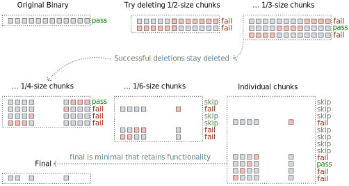

Search-reduce
=============

Reduce a binary to only retain that which is required to continue to
pass a provided test suite.

## Abstract

Search-reduce is a binary rewriting software transformation which
takes a COTS binary executable and a test suite and rewrites the
executable to remove all code which is not required to continue to
pass the test suite.  The search for a the minimal subset of the code
required to retain test-suite functionality is performed quickly and
deterministically using delta-debugging.  First the minimum set of
required functions is found, then the minimum set of basic blocks
within each of these functions is found.  This is a speculative
transformation which is able to achieve very significant reduction in
program size but will likely break untested program behavior.
